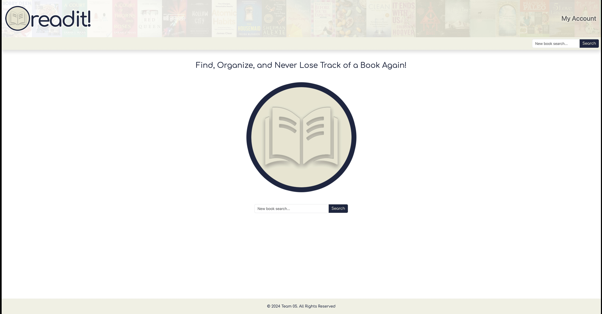

## <a name="top"></a>

# ReadIt!

### Find, Organize, and Never Lose Track of a Book Again!

---


## Description

ReadIt! is a full-stack web application designed to help users find books, log them into their personal bookshelves, write reviews, and create booklists. Users can follow others and see their reading activity, building a community around their reading experiences.

[Visit the Deployed Website](https://readit-pngn.onrender.com/)



## Table of Contents

- [Technologies Used](#technologies-used)
- [Installation](#installation)
- [Usage](#usage)
- [Contributors](#contributors)
- [Questions](#questions)
- [License](#license)

---

## Technologies Used

- **Frontend**: React.js, JavaScript, CSS, HTML
- **Backend**: Node.js, Express.js, PostgreSQL
- **APIs**: Google Books API, New York Times API
- **Authentication**: JWT (JSON Web Tokens)
- **Deployment**: Render
- **Version Control**: Git, GitHub
- **Other Tools**: TypeScript, Sequelize ORM

---

## Installation

**To install this project locally, jump into your terminal application and please follow these steps**:

1. Clone the `ReadIt` Repository to your local machine - first navigate to the directory you would like to clone it into, then:

```bash
Using HTTPS:
git clone https://github.com/Kagen-Smith/ReadIt.git

Using SSH:
git clone git@github.com:Kagen-Smith/ReadIt.git

Using GitHub CLI:
gh repo clone Kagen-Smith/ReadIt
```

2. Navigate into the `ReadIt` directory you just cloned down:

```bash
cd ReadIt
```

3. Install the npm dependencies:

```bash
npm install
```

4. Create an .env file in the root directory and add your Google Book and New York Times API keys:

```bash
GOOGLE_BOOKS_API_KEY=your_google_books_api_key
NYT_API_KEY=your_nyt_api_key
```

5. Start the development server:

```bash
npm start
```

---

## Usage

Once the application is running, navigate to http://localhost:10000 in your browser to access the web app. From there, you can:

    •	Search for books using the Google Books API.
    •	Add books to your bookshelf or bookmark them for future reading.
    •	Write reviews, rate books, and create booklists.
    •	Follow other users to see their book activity.

---

## Contributors

 

|           Team 5 |                                               |                                                                |                                          |                                                                                                                                   |
| ---------------: | --------------------------------------------- | -------------------------------------------------------------- | ---------------------------------------- | --------------------------------------------------------------------------------------------------------------------------------: |
|  **Axel Paxton** | [Email](mailto:axep504@gmail.com)             | [LinkedIn](https://www.linkedin.com/in/axel-paxton-125999311/) | [GitHub](https://github.com/Axe-P)       |        |
| **Ian Ferguson** | [Email](mailto:iansterlingferguson@gmail.com) | [LinkedIn](https://www.linkedin.com/in/ianferguson/)           | [GitHub](https://github.com/TEMPTAG)     |      |
|  **Kagen Smith** | [Email](mailto:kagensmith27@gmail.com)        | [LinkedIn](https://www.linkedin.com/in/kagen-smith/)           | [GitHub](https://github.com/Kagen-Smith) |  |

---

## Questions

If you have any questions or need help, feel free to reach out to any of the contributors via the emails and LinkedIn profiles provided above.

---

## License

This project is covered under the MIT License. The details of the MIT License can be found on their site [HERE](https://opensource.org/licenses/MIT). You can also see the full details of the [LICENSE](./LICENSE) for this specific project in the linked file.

---

<div align="center">
<em>Copyright © 2024 Team 5 - powered by AWESOME humans...</em>

[Back to top](#top)

</div>
